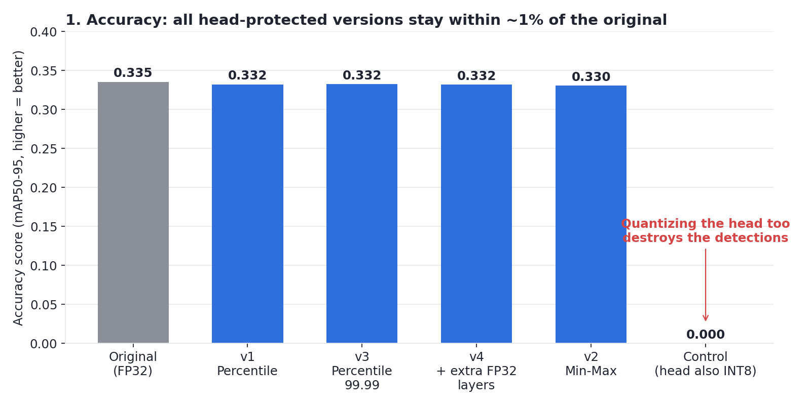
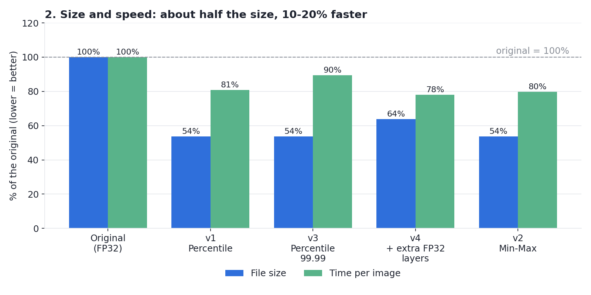
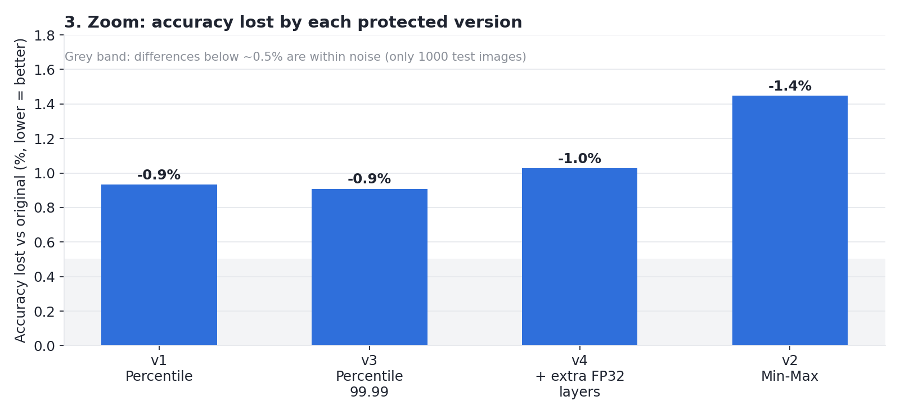

# Benchmarks, Explained Simply

## What we did

We took one detector, **YOLOv5 nano**, and made four compressed versions (plus one deliberately broken control).
Then we gave every version the **same 1000 photos** that humans had already labelled, and measured three things:
**how accurate** it is, **how fast** it is, and **how big** the file is.

None of the 1000 test photos were used for calibration, so the scores are fair.

## The full results

| Model | What's different | Accuracy (mAP50-95) | mAP50 | Precision | Recall | Time / image | File size |
|---|---|---|---|---|---|---|---|
| **Original** | Nothing, full precision | 0.3353 | 0.4745 | 0.614 | 0.420 | 56.2 ms | 10.8 MB |
| **v1** | Compressed, head untouched | 0.3322 | 0.4698 | 0.616 | 0.416 | 45.4 ms | 5.8 MB |
| **v3** | Like v1, clips extreme values harder | 0.3323 | 0.4703 | 0.611 | 0.417 | 50.3 ms | 5.8 MB |
| **v4** | Like v1, plus more layers kept precise | 0.3319 | 0.4709 | 0.604 | 0.421 | 43.8 ms | 6.9 MB |
| **v2** | Simpler calibration (min-max) | 0.3305 | 0.4688 | 0.603 | 0.415 | 44.8 ms | 5.8 MB |
| **Control** | Head compressed too (broken) | 0.0000 | 0.0000 | 0.000 | 0.000 | 31.2 ms | 3.1 MB |

## How to read each column

**Accuracy (mAP50-95)** is the headline number. It runs from 0 (useless) to 1 (perfect).
It rewards finding objects, naming them correctly, *and* drawing tightly fitting boxes.
This model scores about 0.33, which is normal for a "nano" model. The comparison between rows is what matters, not the absolute value.

**mAP50** is the easier version of the same score. A box only needs to roughly overlap the object.

**Precision** answers: when the model says "there's a person here", how often is it right? High precision means few false alarms.

**Recall** answers: of all the people actually in the photos, how many did it find? High recall means few misses.

**Time per image** is the median time to process one 640x640 image on this PC's CPU. Lower is better.

**File size** is what you'd ship or store. Lower is better.

## What the charts say

### 1. Accuracy: nearly unchanged

All four head-protected versions land within about 1% of the original. The control, where the detection layer was also compressed, collapses to zero.

### 2. Size and speed: the payoff

Compressed files are **about 54% of the original size** (64% for v4, which keeps more layers at full precision). Time per image drops by **10-22%**.

### 3. Zoomed in: how much accuracy was lost

v1 and v3 lose about 0.9%, v4 about 1.0%, v2 about 1.4%.

## Why the control scored zero

The detector's final output is one big table that holds box coordinates (numbers up to 640) *and* confidence scores (numbers between 0 and 1) side by side.
INT8 has only 256 possible values, shared across that whole table. Stretching those 256 steps to reach 640 makes each step about 2.5 wide. Every confidence score, being less than 1, rounds to **zero**, so the model "sees" nothing.

This is the reason to leave the Detect layer alone.

## So which should I use?

**v1.** It is the smallest file, one of the most accurate, and among the fastest.

v3 is just as good; the time difference between v1 and v3 (45 vs 50 ms) is measurement noise, since they have an identical structure.

**v4** gives no extra accuracy for 1.1 MB more, so skip it.

**v2** is slightly worse, so skip it.

## How much to trust this

- **Differences under ~0.5% between v1, v2, v3 and v4 are noise.** With 1000 test images we cannot honestly rank them. The solid conclusions are the big ones: protected head gives about a 1% loss, and compressed head gives total failure.
- Speed comes from a single CPU and a single run of 50 timings per model. Treat it as approximate.
- Results are for COCO-style everyday photos. Your own images may behave differently, so test on a sample of them before you deploy.
